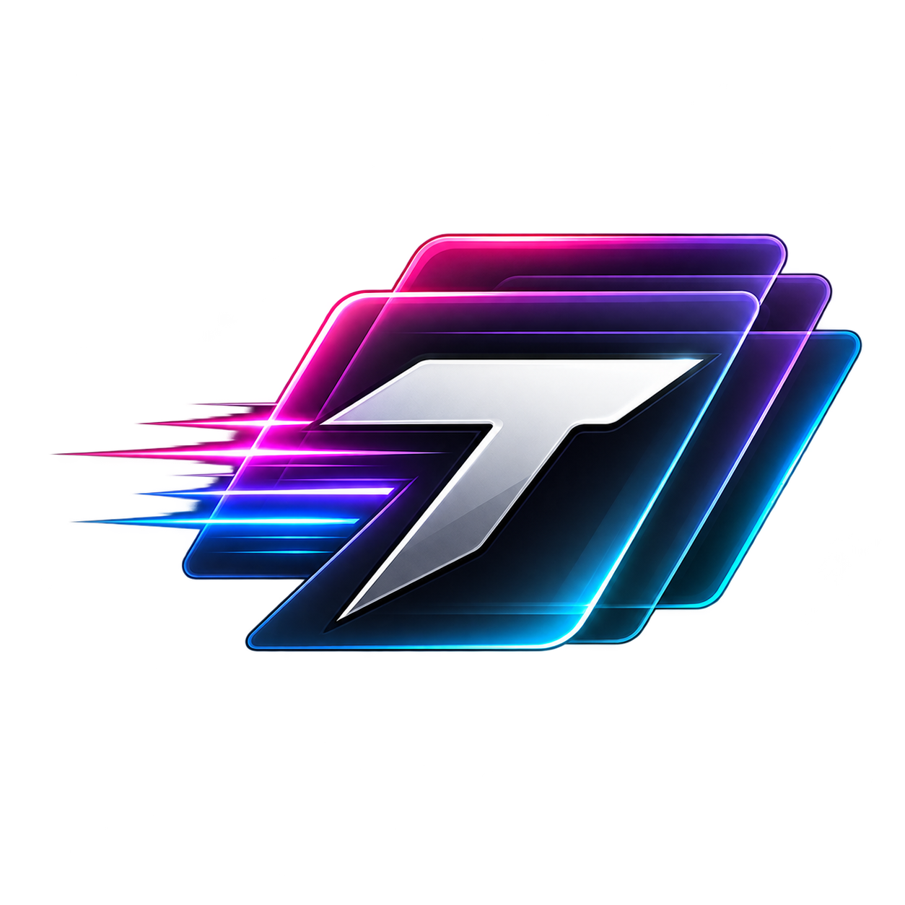

English | [한국어](README.ko.md)

<p align="center">
  
</p>

# TraceDeck FE

### Forza Horizon 6 Vinyl / Decal Tracing & Color Assistant

TraceDeck FE is a Windows utility for manually tracing vinyls and decals in Forza Horizon 6. It combines a target-relative reference overlay, original-pixel color sampling, Forza HSB conversion, palettes and self-contained projects in a portable desktop application.

**Latest release:** [v1.0.0](https://github.com/Revo-32/TraceDeckFE/releases/latest) · **Platform:** Windows 10/11 x64 · **License:** MIT · **Status:** Stable

> TraceDeck FE is an unofficial community tool and is not affiliated with or endorsed by Microsoft, Xbox, Playground Games or the Forza franchise.

## Contents

- [Features](#features)
- [Download](#download)
- [Quick start](#quick-start)
- [Documentation](#documentation)
- [Supported formats](#supported-formats)
- [Project files](#project-files)
- [Requirements](#requirements)
- [Build from source](#build-from-source)
- [Development principles](#development-principles)
- [License](#license)

## Features

- Target-relative reference overlay for manual tracing
- Move, scale, rotate and flip references
- Adjustable reference opacity
- Click-through overlay lock
- Grayscale and contrast assistance
- Target-client grid and center guides
- Original-pixel color picker
- HEX, RGB and Forza HSB conversion
- Named color palettes and automatic palette extraction
- Self-contained `.TDFE` projects with embedded reference data
- Session Undo/Redo, autosave and recovery
- Configurable shortcuts
- English and Korean UI
- Self-contained single-file portable Windows distribution

## Download

Download the latest portable ZIP from [GitHub Releases](https://github.com/Revo-32/TraceDeckFE/releases). Release binaries are not committed to the source repository.

The v1.0.0 asset is named:

`TraceDeckFE-v1.0.0-win-x64-portable.zip`

## Quick start

1. Download and extract the latest portable ZIP.
2. Run `TraceDeckFE.exe`; no separate .NET installation is required.
3. Start Forza Horizon 6 in Windowed or Borderless mode.
4. Let TraceDeck FE detect the game, or choose the target window manually.
5. Open, drop or paste a reference image.
6. Position the overlay, lock it for click-through and begin tracing in Forza.

Settings, logs and recovery snapshots are created under the adjacent `data/` directory. TraceDeck FE does not write application state to AppData.

## Documentation

- [Current status](docs/CURRENT_STATUS.md)
- [Development specification](docs/DEVELOPMENT_SPEC.md)
- [Architecture decisions](docs/DECISIONS.md)
- [Asset provenance](docs/ASSET_PROVENANCE.md)
- [Manual FH6 validation checklist](docs/FH6_MANUAL_VALIDATION_CHECKLIST.md)
- [v1.0.0 release notes](docs/releases/v1.0.0.md)

The Korean PDF manual, `TraceDeck FE 사용방법.pdf`, is included in each portable release. Its reproducible source and validator are tracked in `tools/build_user_guide.py` and `tools/validate_user_guide.py`; the generated PDF is distributed as a release asset rather than repeatedly committed to Git history.

## Supported formats

| Type | Formats | Behavior |
| --- | --- | --- |
| Raster | PNG, JPG/JPEG, WebP, BMP, TIFF/TIF, ICO, AVIF, GIF | Original bytes and pixels are retained. Animated GIF/WebP uses the first frame; TIFF uses the first page. |
| Vector | SVG | Original vector bytes are retained and rendered at a resolution appropriate to the current view. |
| Project | `.TDFE` | Versioned self-contained TraceDeck FE project. |

## Project files

A `.TDFE` project stores the embedded reference image together with transform, overlay, image-assist, guide, color and palette state. Projects validate their structure and reference hash before replacing the current document. Session Undo/Redo history, target window handles and external source paths are not serialized.

## Requirements

### Portable release

- Windows 10 or Windows 11, x64
- Windowed or Borderless Forza mode recommended
- No separately installed .NET runtime required

### Build from source

- Windows 10/11 x64
- [.NET 8 SDK](https://dotnet.microsoft.com/download/dotnet/8.0)
- Visual Studio 2022 or equivalent .NET tooling with Windows desktop support

## Build from source

The following commands are validated from the repository root:

```powershell
dotnet restore TraceDeckFE.sln
dotnet build TraceDeckFE.sln -c Debug --no-restore
dotnet test TraceDeckFE.sln -c Debug --no-build
dotnet build TraceDeckFE.sln -c Release --no-restore
dotnet test TraceDeckFE.sln -c Release --no-build
```

To create the single-file portable release after generating the PDF guide:

```powershell
python -m pip install -r tools/requirements-docs.txt
python tools/build_user_guide.py --output "output/pdf/TraceDeck FE 사용방법.pdf"
python tools/validate_user_guide.py "output/pdf/TraceDeck FE 사용방법.pdf"
dotnet publish src/TraceDeckFE/TraceDeckFE.csproj -c Release -p:PublishProfile=Portable
```

`tools/Build-V1Release.ps1` performs the guarded release-folder and ZIP validation used for v1.0.0.

## Development principles

- No game injection or game-memory modification
- No game capture
- No automatic vinyl/decal generation
- Event-driven overlay and image processing; no continuous FPS renderer
- Original reference fidelity takes priority over destructive shortcuts
- Color sampling reads retained original reference data, not the desktop or game frame
- Unrelated foreground applications naturally cover the non-topmost overlay

See [CONTRIBUTING.md](CONTRIBUTING.md) before proposing major architecture or UX changes. For security guidance, see [SECURITY.md](SECURITY.md).

## License

TraceDeck FE original source code is released under the [MIT License](LICENSE).

Third-party libraries, runtime components and fonts remain under their respective licenses. See [THIRD_PARTY_NOTICES.md](THIRD_PARTY_NOTICES.md) and the preserved texts in [`licenses/`](licenses/).

Created by **Revo\*32** · GitHub [@Revo-32](https://github.com/Revo-32)
